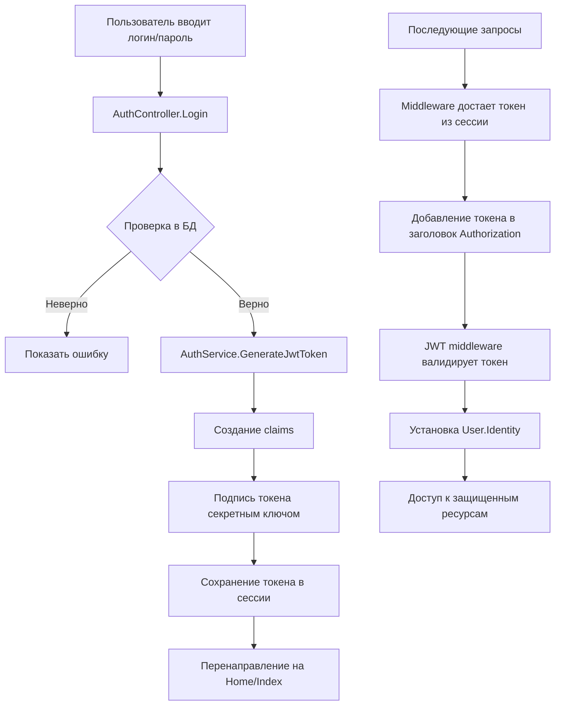

# JWT Аутентификация в ASP.NET Core MVC - JwtAuthApp

## 📋 Обзор проекта

Данное приложение демонстрирует полную реализацию JWT (JSON Web Token) аутентификации в ASP.NET Core MVC. Проект имеет чистую архитектуру с регистрацией пользователей, входом в систему, авторизацией на основе ролей и автоматическим перенаправлением неавторизованных пользователей.

## 🏗️ Структура проекта

```
JwtAuthApp/
├── Controllers/         # MVC контроллеры
│   ├── AuthController.cs      # Регистрация, вход, выход
│   ├── HomeController.cs      # Главная страница (только для авторизованных)
│   ├── AdminController.cs     # Управление пользователями (только Admin)
│   ├── SecureController.cs    # Защищенная страница
│   └── TestController.cs      # Тестовая страница
├── Data/                # Контекст БД и миграции
│   ├── ApplicationDbContext.cs
│   └── Migrations/
├── Models/              # Модели данных
│   ├── User.cs               # Модель пользователя
│   └── ErrorViewModel.cs     # Модель для ошибок
├── Services/            # Бизнес-логика
│   ├── IAuthService.cs       # Интерфейс сервиса аутентификации
│   └── AuthService.cs        # Реализация JWT и хеширования
├── ViewModels/          # Модели представлений
│   └── EditUserViewModel.cs
├── Views/               # Razor представления
│   ├── Auth/
│   ├── Home/
│   ├── Admin/
│   └── Shared/
└── Program.cs           # Точка входа и конфигурация
```

## 🔐 Как работает JWT аутентификация

### 1. **Структура JWT токена**

JWT токен состоит из трех частей, разделенных точками:

```
header.payload.signature
```

- **Header (Заголовок)**: Содержит тип токена и алгоритм подписи
  ```json
  {
    "alg": "HS256",
    "typ": "JWT"
  }
  ```

- **Payload (Полезная нагрузка)**: Содержит claims (утверждения) о пользователе
  ```json
  {
    "sub": "1",
    "unique_name": "john",
    "role": "User",
    "exp": 1741190400
  }
  ```

- **Signature (Подпись)**: Обеспечивает целостность токена
  ```
  HMACSHA256(
    base64UrlEncode(header) + "." +
    base64UrlEncode(payload),
    secret
  )
  ```

### 2. **Поток аутентификации**



### 3. **Ключевые компоненты системы**

#### **AuthService.cs** - Сердце JWT логики

```csharp
public class AuthService : IAuthService
{
    private readonly IConfiguration _configuration;
    private readonly TimeSpan _tokenLifetime = TimeSpan.FromDays(1);

    public string GenerateJwtToken(User user)
    {
        // 1. Создание claims (утверждений)
        var claims = new[]
        {
            new Claim(JwtRegisteredClaimNames.Sub, user.Id.ToString()),
            new Claim(JwtRegisteredClaimNames.UniqueName, user.UserName),
            new Claim(ClaimTypes.NameIdentifier, user.Id.ToString()),
            new Claim(ClaimTypes.Name, user.UserName),
            new Claim(ClaimTypes.Role, user.Role),
            new Claim(JwtRegisteredClaimNames.Jti, Guid.NewGuid().ToString())
        };

        // 2. Создание ключа подписи
        var key = new SymmetricSecurityKey(
            Encoding.UTF8.GetBytes(_configuration["Jwt:Key"]));
        var creds = new SigningCredentials(key, SecurityAlgorithms.HmacSha256);

        // 3. Генерация токена
        var token = new JwtSecurityToken(
            issuer: _configuration["Jwt:Issuer"],
            audience: _configuration["Jwt:Audience"],
            claims: claims,
            expires: DateTime.UtcNow.Add(_tokenLifetime),
            signingCredentials: creds);

        return new JwtSecurityTokenHandler().WriteToken(token);
    }
}
```

#### **Program.cs** - Конфигурация JWT

```csharp
// Настройка аутентификации
builder.Services.AddAuthentication(JwtBearerDefaults.AuthenticationScheme)
    .AddJwtBearer(options =>
    {
        options.TokenValidationParameters = new TokenValidationParameters
        {
            ValidateIssuer = true,
            ValidateAudience = true,
            ValidateLifetime = true,
            ValidateIssuerSigningKey = true,
            ValidIssuer = builder.Configuration["Jwt:Issuer"],
            ValidAudience = builder.Configuration["Jwt:Audience"],
            IssuerSigningKey = new SymmetricSecurityKey(
                Encoding.UTF8.GetBytes(builder.Configuration["Jwt:Key"]))
        };
        
        // Обработка неавторизованных запросов
        options.Events = new JwtBearerEvents
        {
            OnChallenge = context =>
            {
                context.HandleResponse();
                context.Response.Redirect("/Auth/Login");
                return Task.CompletedTask;
            }
        };
    });
```

### 4. **Безопасность паролей**

Пароли никогда не хранятся в открытом виде. Используется PBKDF2 с солью:

```csharp
public (string hash, string salt) HashPassword(string password)
{
    // Генерация случайной соли
    byte[] saltBytes = new byte[32];
    RandomNumberGenerator.Fill(saltBytes);
    string salt = Convert.ToBase64String(saltBytes);

    // Хеширование с 10000 итерациями
    using var pbkdf2 = new Rfc2898DeriveBytes(
        password, 
        saltBytes, 
        10000, 
        HashAlgorithmName.SHA256);
    
    byte[] hashBytes = pbkdf2.GetBytes(32);
    string hash = Convert.ToBase64String(hashBytes);

    return (hash, salt);
}
```

### 5. **Защита от атак по времени**

При проверке пароля используется `FixedTimeEquals` для предотвращения timing attacks:

```csharp
public bool VerifyPassword(string password, string hash, string salt)
{
    byte[] saltBytes = Convert.FromBase64String(salt);
    byte[] storedHash = Convert.FromBase64String(hash);

    using var pbkdf2 = new Rfc2898DeriveBytes(password, saltBytes, 10000, HashAlgorithmName.SHA256);
    byte[] computedHash = pbkdf2.GetBytes(32);
    
    // Защита от timing attacks
    return CryptographicOperations.FixedTimeEquals(computedHash, storedHash);
}
```

### 6. **Хранение токена**

В этом проекте токен хранится в сессии, а не в cookies:

```csharp
// После успешного входа
HttpContext.Session.SetString("JWToken", token);

// Middleware для добавления токена в заголовок
app.Use(async (context, next) =>
{
    var token = context.Session.GetString("JWToken");
    if (!string.IsNullOrEmpty(token))
    {
        context.Request.Headers["Authorization"] = "Bearer " + token;
    }
    await next();
});
```

### 7. **Защита контроллеров**

```csharp
// Доступен только авторизованным пользователям
[Authorize]
public class HomeController : Controller

// Доступен только администраторам
[Authorize(Roles = "Admin")]
public class AdminController : Controller

// Доступен всем (вход/регистрация)
[AllowAnonymous]
public class AuthController : Controller
```

## 🔄 Полный цикл аутентификации

### **Регистрация нового пользователя**
1. Пользователь заполняет форму регистрации
2. `AuthService.HashPassword()` создает соль и хеш пароля
3. Пользователь сохраняется в БД
4. `AuthService.GenerateJwtToken()` создает JWT токен
5. Токен сохраняется в сессии
6. Перенаправление на главную страницу

### **Вход существующего пользователя**
1. Пользователь вводит логин/пароль
2. Поиск пользователя в БД по UserName
3. `AuthService.VerifyPassword()` проверяет пароль
4. При успехе - генерация JWT токена
5. Сохранение токена в сессии
6. Перенаправление на главную страницу

### **Доступ к защищенным ресурсам**
1. Пользователь переходит по URL
2. Middleware достает токен из сессии
3. Токен добавляется в заголовок Authorization
4. JWT middleware валидирует токен
5. Если токен валиден - доступ разрешен
6. Если нет - перенаправление на /Auth/Login

### **Выход из системы**
1. Пользователь нажимает "Logout"
2. Токен удаляется из сессии
3. Перенаправление на страницу входа

## 🛠️ Настройка приложения

### **appsettings.json**
```json
{
  "ConnectionStrings": {
    "DefaultConnection": "Host=localhost;Database=JwtAuthAppDb;Username=postgres;Password=password"
  },
  "Jwt": {
    "Key": "Your-Very-Long-Secret-Key-At-Least-32-Characters",
    "Issuer": "JwtAuthApp",
    "Audience": "JwtAuthAppUsers",
    "ExpireDays": 1
  }
}
```

### **Миграции базы данных**
```bash
# Создание миграции
dotnet ef migrations add InitialCreate -o Data/Migrations

# Применение миграций
dotnet ef database update
```

## 📊 Тестирование

### **Предустановленный суперпользователь**
При первом запуске автоматически создается пользователь:
- **Логин:** su
- **Пароль:** su
- **Роль:** Admin

### **Проверка функциональности**
1. Запустите приложение: `dotnet run`
2. Перейдите по адресу: `http://localhost:5258`
3. Должно произойти перенаправление на `/Auth/Login`
4. Войдите как `su/su`
5. После входа откроется главная страница
6. Проверьте доступ к `/Admin` (только для Admin)
7. Нажмите "Logout" для выхода

## 🎯 Особенности реализации

1. **Stateless аутентификация** - сервер не хранит состояние сессии (кроме самого токена)
2. **PBKDF2 хеширование** - надежное хеширование паролей с солью
3. **Защита от timing attacks** - безопасное сравнение хешей
4. **Ролевая авторизация** - разделение прав обычных пользователей и администраторов
5. **Автоматическое перенаправление** - удобная навигация для неавторизованных
6. **CSRF защита** - антифордж токены для POST запросов

## 📚 Используемые технологии

- **ASP.NET Core 9.0** - фреймворк
- **Entity Framework Core 9.0** - ORM
- **PostgreSQL** - база данных
- **JWT Bearer Authentication** - аутентификация
- **Bootstrap 5** - стилизация
- **Swagger/OpenAPI** - документация API

## 🚀 Возможные улучшения

1. **Refresh tokens** - добавить обновление токенов
2. **Логирование** - расширенное логирование действий
3. **Email подтверждение** - при регистрации
4. **Two-factor authentication** - двухфакторная аутентификация
5. **Rate limiting** - ограничение количества попыток входа
6. **Docker** - контейнеризация приложения

---

## 📝 Заключение

Данный проект демонстрирует промышленный подход к реализации JWT аутентификации в ASP.NET Core MVC. Он включает все необходимые компоненты: безопасное хеширование паролей, генерацию и валидацию токенов, защиту маршрутов и удобный пользовательский интерфейс.

Код организован с соблюдением лучших практик: разделение ответственности, внедрение зависимостей, использование интерфейсов и middleware компонентов.